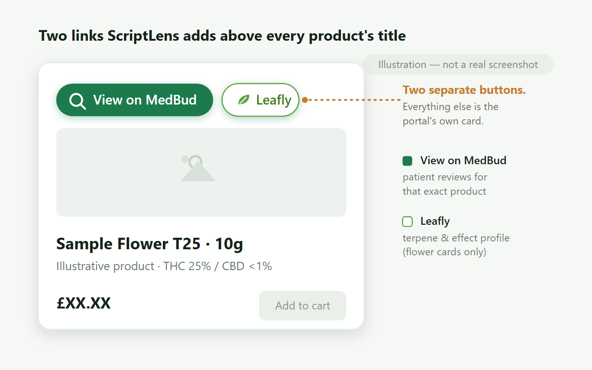

# StrainInspector

A browser extension that links every medication in the CB1 Medical patient portal to its
[MedBud](https://medbud.wiki) patient reviews and its [Leafly](https://www.leafly.com) strain profile.
No more opening a second tab and searching for each product by hand.

  

  

It's free, open source, and not affiliated with CB1 Medical, MedBud or Leafly. It runs entirely in your
browser. There's no analytics, no account, and no personal or medical data ever leaves it (see the
[privacy policy](PRIVACY.md)).

Every catalogue card and medication in a past order gets a small **View on MedBud** button above its
title. Most of the time it opens the medication's exact MedBud page. If MedBud has renamed a product or
hasn't listed it yet, the button runs a search that lands on it instead, and the item looks the same
either way.

Flower gets a second button, **Leafly**, for the strain's terpene and effect profile. MedBud has
the patient reviews, Leafly has the strain data. Leafly names its strains differently from CB1, so that
link runs a search scoped to Leafly's strain pages rather than guessing a URL that would usually be
wrong.

The extension only ever gives you a link. It doesn't fetch reviews or ratings to show on the card.
Reading MedBud's ratings automatically would need their permission, and their pages block automated
requests anyway, so StrainInspector sends you to the reviews instead of scraping them.

## Installing

Install it from the Chrome Web Store. It works in Chrome, Brave, Edge and other Chromium browsers.

*(The listing is currently in review; the link will go live here once it's published.)*

### Installing from source

If you'd rather load it unpacked:

1. Download this repository (**Code → Download ZIP**, or clone it) and unzip it.
2. Open `chrome://extensions` and turn on **Developer mode**.
3. Click **Load unpacked** and pick the folder.

There's no build step. It loads as-is.

## How it works

StrainInspector carries a built-in copy of MedBud's product list. When a page loads, it reads each product's
name from its catalogue card or past-order row and looks it up. A confident match links straight to that
medication's MedBud page; anything it can't place (a renamed product, or one added since the built-in list
was captured) links to a MedBud search instead, which still lands you on it.

The search fallback is normal, not a failure. Stock rotates and MedBud renames things, and some products
can't be matched by name alone, but either way you still get a working link. Resolved links are cached
briefly so pages stay fast.

## Configuration

- **Minimum match confidence.** Raise it if a card shows the wrong medication. Lower it if a familiar
  product falls back to a search.
- **Show a search link on products the bundled formulary doesn't list.** On by default.
- **Debug logging.** Logs matching decisions to the service worker console.
- **Clear all cached data.**

## Good to know

- A major redesign of the CB1 portal could stop it working. If that happens the buttons simply stop
  appearing, rather than quietly sending you to the wrong page.
- The medication list is built into the extension and doesn't update itself, so a brand-new product can
  fall back to a search until the list is refreshed.
- MedBud ratings are patient opinions from a community site, not medical advice. They help you narrow a
  shortlist, not decide what to take. That's a conversation for your prescriber.
- Not affiliated with, endorsed by, or connected to CB1 Medical, MedBud or Leafly.

## Support

Free, and maintained in spare time. If it saves you time, you can
[sponsor its upkeep](https://github.com/sponsors/Cheesewizard). It's optional, and stays free either way.

## Development

Contributions and fixes are welcome. Run the tests with `npm install`, then `npm test`. Keeping the
built-in medication list current, and everything else a maintainer needs, is in
[docs/MAINTENANCE.md](docs/MAINTENANCE.md). Changes are logged in [CHANGELOG.md](CHANGELOG.md).
